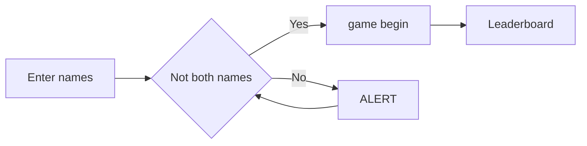
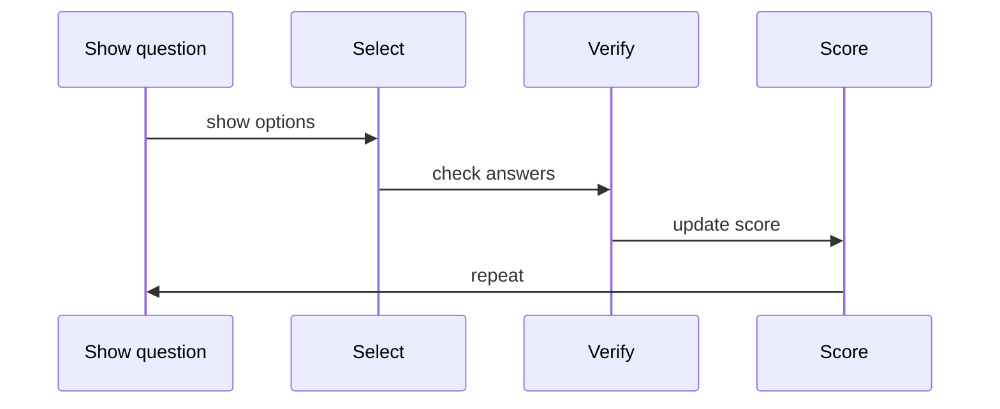

# QUIZZ_LER

<p align="center">
  
</p>
<h2 align="center">A web quiz about about html/css/js</h2>

## ✨ Key features

- **Scoring system** player who answer first get a bonus
- **Winner page** that shows the winner at the end of the gamme
- **Multiplayer** requires two players to play

## 📊 How to play

> diagram explaining steps to use the website



### Game Logic

> diagram explaining how scoring works



## 💻 Code with Syntax Highlighting

```javascript
function renderMarkdown() {
  const markdown = markdownEditor.value;
  const html = marked.parse(markdown);
  const sanitizedHtml = DOMPurify.sanitize(html);
  markdownPreview.innerHTML = sanitizedHtml;

  // Syntax highlighting is handled automatically
  // during the parsing phase by the marked renderer.
  // Themes are applied instantly via CSS variables.
}
```

## 🆚 Score Comparison

|      :Criteria:       |          score           |
| :-------------------: | :----------------------: |
|    player x faster    |  bonus +5 for player x   |
| player changed answer |       bonus resets       |
|   player x correct    |     +10 for player x     |
|    player x wrong     | health -20% for player x |
