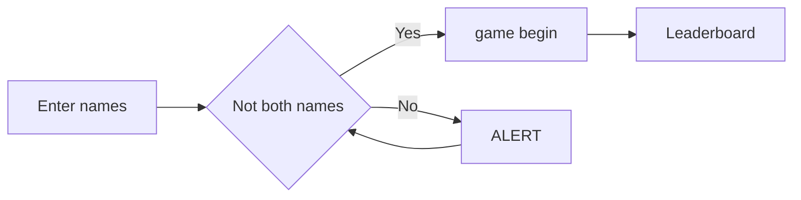
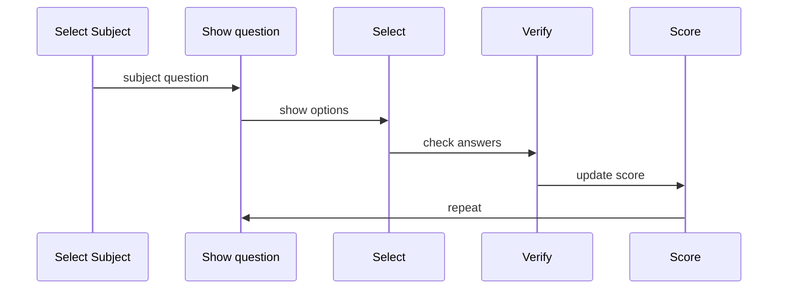

<h1 align="center">QUIZZ_LER</h1>
<h2 align="center">A web quiz about about html/css/js</h2>
  

<table>
  <tr>
    <td colspan="2"></td>
  </tr>
  <tr>
    <td></td>
    <td></td>
  </tr>
</table>

## ✨ Key features

- **Scoring system** player who answer first get a bonus
- **Winner page** that shows the winner at the end of the gamme
- **Multiplayer** requires two players to play

## 📊 How to play

> diagram explaining steps to use the website



### Game Logic

> diagram explaining how scoring works



## 💻 Technology

- HTML
- CSS
- JS

## 🆚 Score Comparison

|      :Criteria:       |          score           |
| :-------------------: | :----------------------: |
|    player x faster    |  bonus +5 for player x   |
| player changed answer |       bonus resets       |
|   player x correct    |     +10 for player x     |
|    player x wrong     | health -20% for player x |

## New discoveries

<details>
<summary>Get time</summary>
  
  ```javascript
      startTime = Date.now();
  ```
</details>

<details>
<summary>Load from Json</summary>
  
  ```javascript
      
async function loadQuestions(topic) {
  try {
    console.log("loading", topic);
    const response = await fetch(`../questions/${topic}.json`);
    const data = await response.json();
    return data;
  } catch (error) {
    console.error("Error loading questions:", error);
  }
}
  ```
</details>

<details>
<summary>Modular Coding</summary>

when importing from another **.js** file, thie **export** before the used function must be written:

```javascript
export function main(file) {
  console.log("main function");

  document.getElementById("file").remove();

  console.log(`player1: ${document.querySelectorAll(".glow")[0].textContent}`);
  player1Name = document.querySelectorAll(".glow")[0].textContent;

  console.log(`player2: ${document.querySelectorAll(".glow")[1].textContent}`);
  player2Name = document.querySelectorAll(".glow")[1].textContent;

  loadQuestions(file).then((q) => {
    questionsList = q; // store all questions
    createScoreUI();
    startGame(); // start loop
  });
}
```

</details>

## 🆚 Difficulties & Solutions

| Difficulties                   |       Solutions       |
| :----------------------------- | :-------------------: |
| Where to get Quizes            |    Stored in Json     |
| Which Json file to choose      |     User defined      |
| Html elements when game begins | created by javascript |
