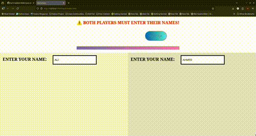
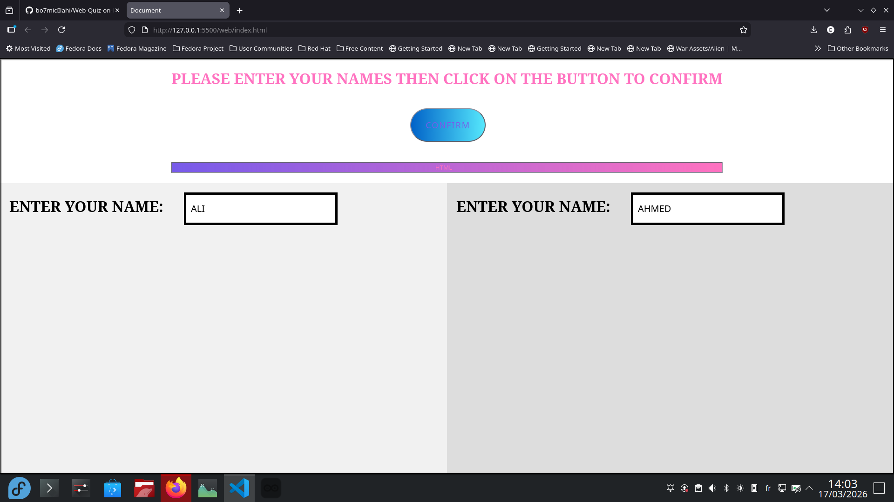
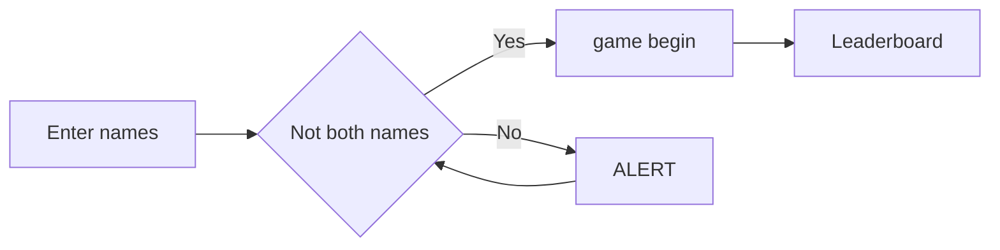
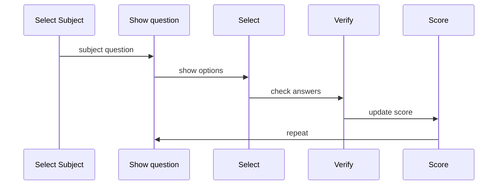

<h1 align="center">QUIZZ_LER</h1>
<h2 align="center">A web quiz about about html/css/js</h2>
  

<table>
  <tr>
    <td colspan="2"></td>
  </tr>
  <tr>
    <td></td>
    <td></td>
  </tr>
  <tr>
    <td colspan="2" align="center">
  </tr>
</table>

## ✨ Key features

- **Scoring system** player who answer first get a bonus
- **AZERTY & QWERTY** supports both type of keyboards
- **Winner page** that shows the winner at the end of the gamme
- **Multiplayer** requires two players to play
- **Button Inputs** via arduino for the 1st player _ONLY_

## 📊 How to play

> diagram explaining steps to use the website



### Game Logic

> diagram explaining how scoring works



## 💻 Technology

- HTML
- CSS
- JS
- Arduino

## 🆚 Score Comparison

|       Criteria        |          score           |
| :-------------------: | :----------------------: |
|    player x faster    |  bonus +5 for player x   |
| player changed answer |       bonus resets       |
|   player x correct    |     +10 for player x     |
|    player x wrong     | health -20% for player x |

## New discoveries

<details>
<summary>Get time</summary>
  
  ```javascript
      startTime = Date.now();
  ```
</details>

<details>
<summary>Load from Json</summary>
  
  ```javascript
      
async function loadQuestions(topic) {
  try {
    console.log("loading", topic);
    const response = await fetch(`../questions/${topic}.json`);
    const data = await response.json();
    return data;
  } catch (error) {
    console.error("Error loading questions:", error);
  }
}
  ```
</details>

<details>
<summary>Modular Coding</summary>

when importing from another **.js** file, thie **export** before the used function must be written:

```javascript
export function main(file) {
  console.log("main function");

  document.getElementById("file").remove();

  console.log(`player1: ${document.querySelectorAll(".glow")[0].textContent}`);
  player1Name = document.querySelectorAll(".glow")[0].textContent;

  console.log(`player2: ${document.querySelectorAll(".glow")[1].textContent}`);
  player2Name = document.querySelectorAll(".glow")[1].textContent;

  loadQuestions(file).then((q) => {
    questionsList = q; // store all questions
    createScoreUI();
    startGame(); // start loop
  });
}
```

</details>

<details>
<summary>Button Inputs</summary>

By wiring the buttons to the arduino _MICRO_, I used a library called Keyboard.h in order to simulate keyboard inputs. It follows the AZERTY/QWERTY configuration of the PC the MICRO is linked to it.

```cpp
#include <Keyboard.h>

const int buttonPinK = 2; // Pin connected to button
const int buttonPinL = 3; // Pin connected to button
const int buttonPinM = 4; // Pin connected to button

void setup() {
  pinMode(buttonPinK, INPUT_PULLUP); // Use internal pull-up
  pinMode(buttonPinL, INPUT_PULLUP); // Use internal pull-up
  pinMode(buttonPinM, INPUT_PULLUP); // Use internal pull-up

  Serial.begin(115200);
  Keyboard.begin();
}

void loop() {
  if (digitalRead(buttonPinK) == LOW) {
    Serial.println("A");
    Keyboard.write(65);
  }
  if (digitalRead(buttonPinL) == LOW) {
    Serial.println("Z");
    Keyboard.write(90);
  }
  if (digitalRead(buttonPinM) == LOW) {
    Serial.println("E");
    Keyboard.write(69);
  }else{
    Serial.println("NOTHING");
  }
  delay(50);
}

```

</details>

## 🆚 Difficulties & Solutions

| Difficulties                      |             Solutions              |
| :-------------------------------- | :--------------------------------: |
| Where to get Quizes               |           Stored in Json           |
| Which Json file to choose         |            User defined            |
| Html elements when game begins    |       created by javascript        |
| Micro couldn't send _M_ character | Set the buttons for the 1st Player |
